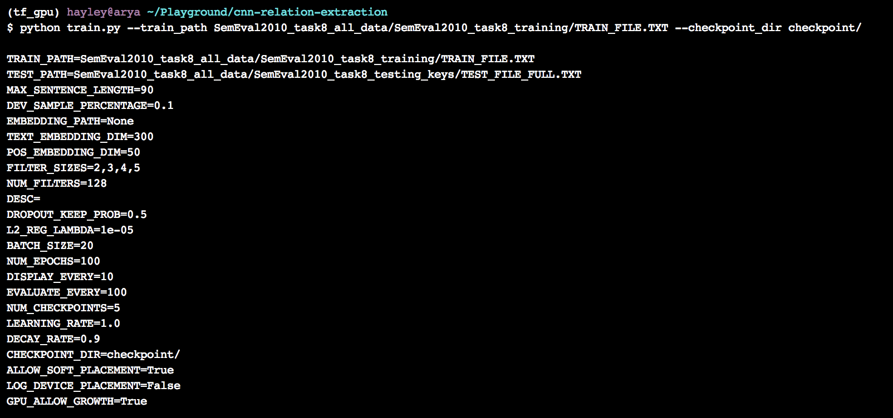
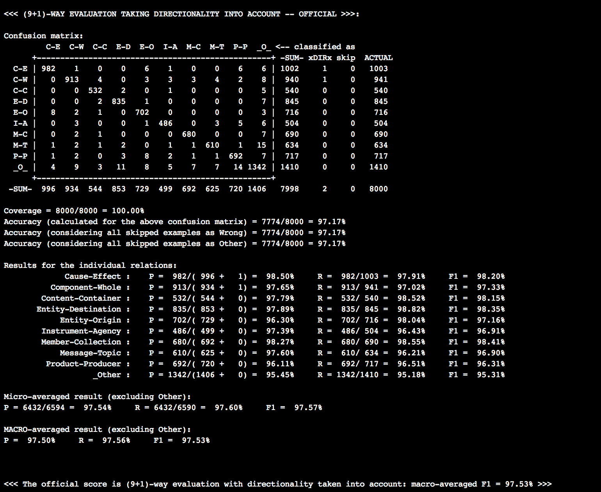
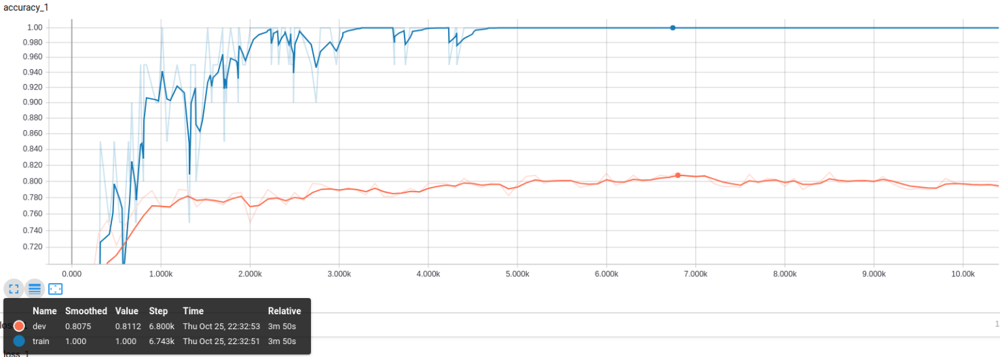
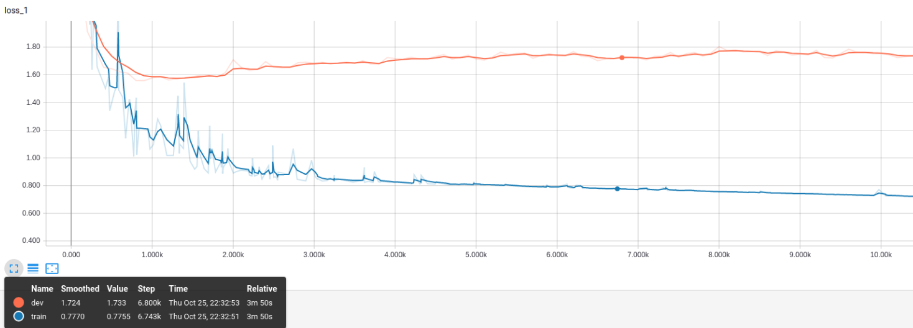

# CSCI 699 HW2: Relation Extraction
## Hayley Song

## Introduction
In this assignment, I will implement a model for the relation extraction task using two 
deep learning architectures, CNN-based (`CNN`) and attention-based BiDirectional LSTM (`Att-biLSTM`).
We will train and evaluate our model on SemEval 2010 Task 8 dataset. This dataset consists of 
sentences with the head and tail entities annotated and contains 9 different relations such 
as "Cause-Effect" and "Component-Whole".  Each sentence in the training dataset has two entities 
`E1` and `E2` and their relation `REL` from the set of 9 relations.  The goal of the relation 
extraction task is to build a model that can predict the correct relation type given a new 
sentences with two entities already annotated.  The SemEval dataset is split into the training
and testing dataset, and we will use the training set for the train and validation phase
(the later for hyper-parameter tuning), and tthe final model will make predictions on the 
testing set as a part of the assignment submission.

## Workflow
The overall workflow for training and evaluating a model for the relation extraction for HW2
is as follows. 
1. Data preprocessing
2. Feature design
3. Model training
4. Model selection
5. Test/Evaluation

## 1. Data Preprocessing

## 2. Features
### Hand-designed
First, I used the following hand-designed features to represent the data samples in the feature space.
1. Entity-based features
For instance, if $E1$ is "American Airlines", then we can add features like its `type` (eg. `ORG`) and its head word 
(eg. `airlines`), and if $E2$ IS "Tim Wagner", the corresponding features would be `PERSON` and `wagner`.

2. Word-based features
Another type of manual features is based on the neighboring words to capture the short-distance context of the entities.  
Three features of this type were extracted for each entity, Between-entity bag of words, Words before $E1$ and Words after
$E2$.

3. Syntactic features
Lastly, three synatactic features were extracted for each entity: typed-dependency path.  Other possible features are 
constitutent path and base syntactic chunk path. 
<figure>
    
    <figcaption text-align='center' > 
        <b> Figure 1: Examples of features from a given sentence with two marked entities</b> 
    </figcaption>    
</figure>

### Embeddings
We used the word2vec embedding for the CNN model and Glove embedding for the attention-based
bidirectional LSTM model.  The embeddings are implemented in the `scripts/utils.py` file.
1. Word embedding
2. Positional embedding
3. Glove Embedding

## 3. Model Archietectures
The model architectures can be found in the `scripts` directory.
- `text_cnn.py`: CNN-based model
- `lstm.py`: bidirectional LSTM model
- `attnetion.py` and `att_lstm.py`: attention mechanism and bidirectional LSTM with attention model

1. CNN
2. Bidirectional LSTM
3. Attention-based Bidirectional LSTM 

## 4. Train and Validation
Please refer to `scripts/train_cnn.py` and `scripts/train_att_lstm.py` for the training scripts.
We randomly split the provided training dataset to training, validation and evaluation sets in 
7:1.5:1.5 ratio. The datasets will be referred to as `ds_train`, `ds_val` and `ds_eval`.  
The validation set was used to tune the hyperparameters, and the evaluation set is used to
compare the performances of the two models.

1. CNN
Below is the configuration for my CNN model.
<figure>
    
    <figcaption text-align='center' > 
        <b>Figure 2: Hyper parameters for training CNN model</b> 
    </figcaption>    
</figure>

2. Attention-based Bidirectional LSTM(`Att-biLSTM`)
Below is the configuration for the Att-biLSTM model.
<figure>
    
    <figcaption text-align='center' > 
        <b>Figure 2: Hyper parameters for training Att-biLSTM model</b> 
    </figcaption>    
</figure>

## 4. Performances and Analysis
1. CNN
CNN model achieved the accuracy of 78.10%, Micro F1 of 83.04% and Macro F1 of 82.27% 
on the traning set:
<figure>
    
    <figcaption text-align='center' > 
        <b>Figure 3: Hyper parameters for training Att-biLSTM model</b> 
    </figcaption>    
</figure>
The confusion matrix shows that the CNN based model performed the best in detecting the `Cause-Effect` 
relationship (90.27% F1) ,wherease it had the most difficulty in classifying the `Instrument-Agency` relationship
(73.58% F1) and `Other` (49.88% F1).

Below is the accuracy and loss curve during the training steps.
<figure>
    
    <figcaption text-align='center' > 
        <b>Figure 4: Accuracy vs. Iterations of CNN model</b> 
    </figcaption>    
</figure>

<figure>
    
    <figcaption text-align='center' > 
        <b>Figure 5: Loss vs. Iterations of CNN model</b> 
    </figcaption>    
</figure>

2. Attention-based Bidirectional LSTM(`Att-biLSTM`)

