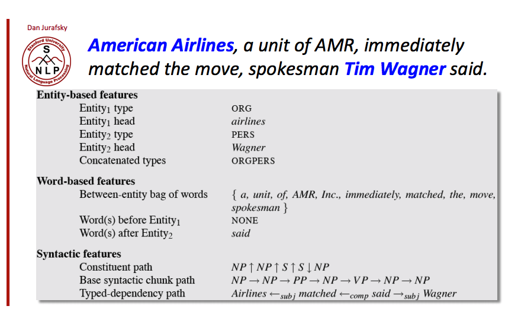

# CSCI 699 HW2: Relation Extraction
## Hayley Song

## Introduction
In this assignment, I will implement a model for the relation extraction task using two 
deep learning architectures, CNN-based (`CNN`) and attention-based BiDirectional LSTM (`Att-biLSTM`).
We will train and evaluate our model on SemEval 2010 Task 8 dataset. This dataset consists of 
sentences with the head and tail entities annotated and contains 9 different relations such 
as "Cause-Effect" and "Component-Whole".  Each sentence in the training dataset has two entities 
`E1` and `E2` and their relation `REL` from the set of 9 relations.  The goal of the relation 
extraction task is to build a model that can predict the correct relation type given a new 
sentences with two entities already annotated.  The SemEval dataset is split into the training
and testing dataset, and we will use the training set for the train and validation phase
(the later for hyper-parameter tuning), and tthe final model will make predictions on the 
testing set as a part of the assignment submission.

## Workflow
The overall workflow for training and evaluating a model for the relation extraction for HW2
is as follows. 
1. Data preprocessing
2. Feature design
3. Model training
4. Model selection
5. Test/Evaluation

## 1. Data Preprocessing

## 2. Features
### Hand-designed

<figure>
    
    <figcaption text-align='center' > 
        <b> Figure 1: Examples of features from a given sentence with two marked entities</b> 
    </figcaption>    
</figure>

1. Entity-based features
2. Word-based features
3. Syntactic features

### Embeddings
1. Word embedding
2. Positional embedding

## 3. Model Archietectues
The model architectures can be found in the `scripts` directory.
- `text_cnn.py`: CNN-based model
- `lstm.py`: bidirectional LSTM model
- `attnetion.py` and `att_lstm.py`: attention mechanism and bidirectional LSTM with attention model

1. CNN
2. Bidirectional LSTM
3. Attention-based Bidirectional LSTM (`Att-biLSTM`)

## 4. Train and Validation
Please refer to `scripts/train_cnn.py` and `scripts/train_att_lstm.py` for the training scripts.
We randomly split the provided training dataset to training, validation and evaluation sets in 
7:1.5:1.5 ratio. The datasets will be referred to as `ds_train`, `ds_val` and `ds_eval`.  
The validation set was used to tune the hyperparameters, and the evaluation set is used to
compare the performances of the two models.

## 4. Performances
1. CNN
2. Bidirectional LSTM
3. Bidirectional GRU

## 5.  Analysis

